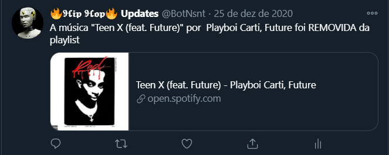
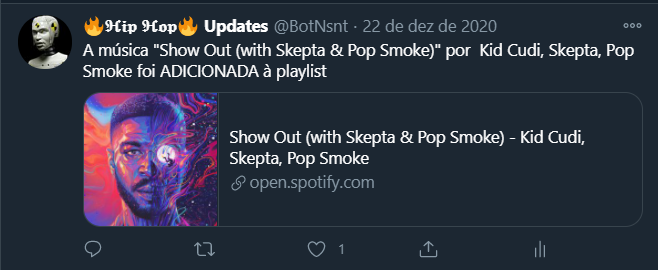

# Spotify Playlist Update Tweeter Bot
Bot que posta qualquer atualização ocorrida em uma determinada playlist do spotify em uma determinada conta no twitter, utilizando a API do spotify e do twitter

Exemplos:

### COMO UTILIZAR 

1 - Crie um aplicativo no site developer spotify (https://developer.spotify.com/dashboard/login) e copie o "client id" e o "client secret" e copie o id da playlist do spotify que vc pretende utilizar, em seguida cole essas informações dentro do arquivo "SpotifySecrets.py" nos devidos lugares.

2 - Faça o mesmo para as chaves do twitter porém nesse link: (url: https://developer.twitter.com/en) e cole no arquivo "tweepy_keys.py".

3 - Execute o arquivo "main.py" e aproveite *u*

*Instagram = https://www.instagram.com/gustavocn_  ou  @gustavocn_
*Linkedin = https://www.linkedin.com/in/gustavocn/  
*Github = https://github.com/gustavocn121

------------------------------------------------------------------------------------------------------------------------------------------------------

### HOW TO USE

1 - get the spotify secrets by creating an application in this website (https://developer.spotify.com/dashboard/login) and the id of the playlist you desire then pasting it in the right spots in the "SpotifySecrets.py" file

2 - the same but for the twitter api (url: https://developer.twitter.com/en) and pasting it to the "tweepy_keys.py" file

3 - run the "main.py" file and have fun *u*

*Instagram = https://www.instagram.com/gustavocn_  or  @gustavocn_
*Linkedin = https://www.linkedin.com/in/gustavocn/
